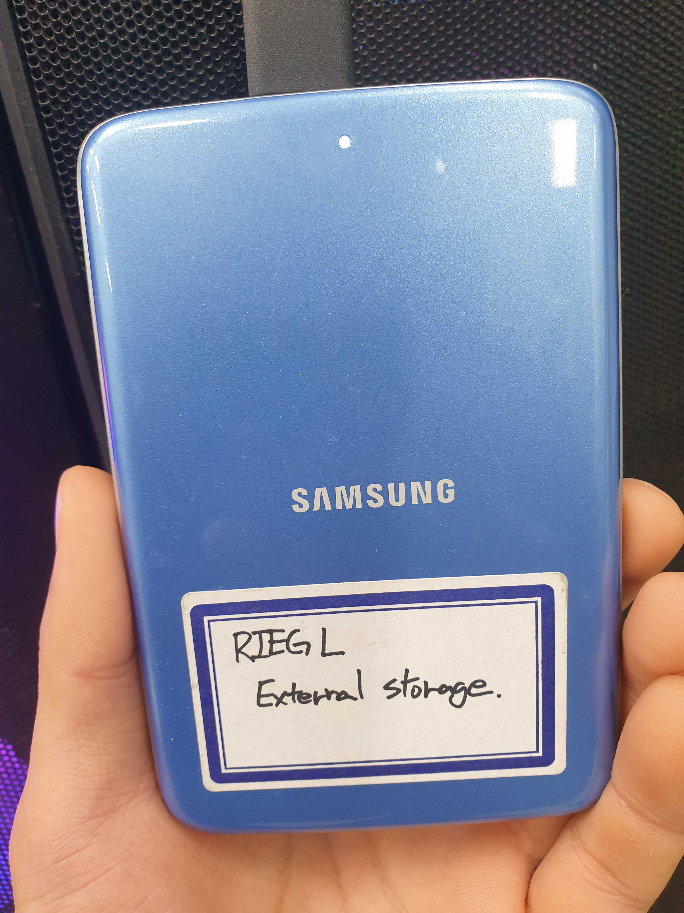

# [RyuLab]TLS_ULS_dataManagementProtocol

This page explains how to manage Riegl TLS and ULS dataset 
- ULS
https://docs.google.com/spreadsheets/d/1wb4QeWr6PL7wAuJscyQ-VGBiKfCVTcCDWBeLWDFpreo/edit#gid=0 
_TLS
https://docs.google.com/spreadsheets/d/1Lxt5jdBka6yrYdIJKT22Innl_30Hz9w4j39qNTnubMQ/edit#gid=735285282
### 1. Upload field data to external HDD

  

  
 + #### HDD folder structure
```   
 📦TLS_ULS_riegl  
  ┣ 📂11GDK_TLSriegl  
  ┣ 📂12GDK_ULSriegl  
  ┣ 📂21TCK_TLSriegl  
  ┣ 📂22TCK_ULSriegl  
  ┣ 📂31HWK_TLSriegl  
  ┗ 📂32HWK_ULSriegl 
```
## 2. Process field data 
+ TLS  
  Process using RISCAN PRO 2.18
    
+ ULS  
  Process using POSPAC UAV 8.4 + RISPROCESS 1.9.3

For more detail, ask @Tackang @Yunsoo

## 3. Upload processed field data to server

+ #### Server folder path ( /esail3/Tackang/* )
```
📦esail3  
 ┗ 📂Tackang  
   ┣ 📂11GDK_TLSriegl  
   ┣ 📂12GDK_ULSriegl  
   ┣ 📂21TCK_TLSriegl  
   ┣ 📂22TCK_ULSriegl  
   ┣ 📂31HWK_TLSriegl  
   ┗ 📂32HWK_ULSriegl 
```

## 4. Handling errors  
* When error occurs for license of Riscan Pro, go to 'Service' of license PC and turn off 'RIEGL License Service' and 'RIEGL LicenseProxy'. Then do 'Launch server' in LicenseServer Administration Center

